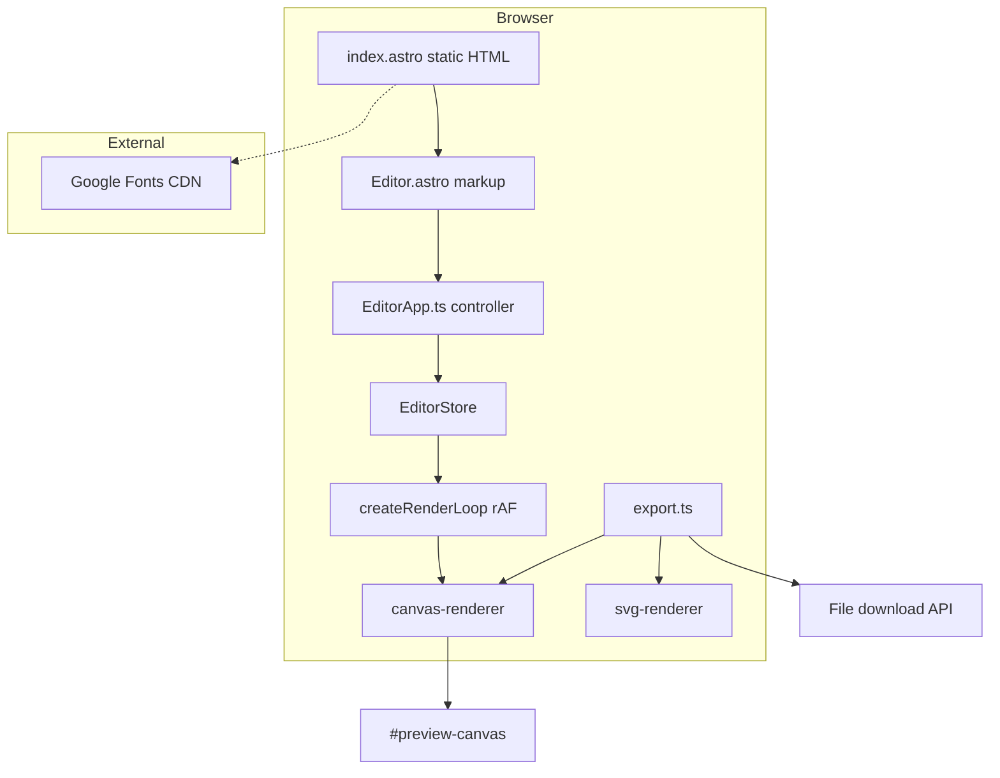

# Typeframe — Architecture & Technical Audit

**Project:** Typeframe (text-to-image studio)  
**Version:** 0.0.1  
**Audit date:** June 2026  
**Stack:** Astro 6 · TypeScript (strict) · Vanilla CSS · Canvas 2D · SVG export  

---

## 1. Executive summary

Typeframe is a **client-only static web app** that converts user text into exportable images. Astro ships a zero-JS HTML shell; a single bundled client script (`EditorApp.ts`) powers the editor, preview, and export. There is **no backend**, **no database**, and **no authentication**.

| Area | Status | Notes |
|------|--------|-------|
| Architecture clarity | Good | Clear separation: UI → store → renderers |
| Production readiness | Partial | Core loop works; worker export and SVG parity incomplete |
| Performance | Good (design) | rAF preview, scaled canvas; fonts are external CDN |
| Security | Low risk | No secrets; client-side only; upload uses blob URLs |
| Test coverage | None | No unit, e2e, or visual regression tests |
| Accessibility | Partial | Labels exist; canvas preview lacks text alternative |

---

## 2. System context



**Deployment model:** `astro build` → static `dist/` → any static host (Netlify, Vercel, S3, etc.).

---

## 3. Technology stack

| Layer | Choice | Version (lockfile) |
|-------|--------|-------------------|
| Framework | Astro | ^6.4.3 |
| Language | TypeScript | strict (`tsconfig.json`) |
| Styling | Vanilla CSS | tokens + global + editor |
| Rendering | Canvas 2D API | Primary |
| Vector export | SVG strings | Secondary |
| State | Custom pub/sub | `EditorStore` |
| UI framework | None | Intentional (bundle size) |
| Node | ≥22.12.0 | `package.json` engines |

**Dependencies:** Single production dependency (`astro`). No React, Vue, Tailwind, or state libraries.

---

## 4. Repository structure

```
typeframe/
├── astro.config.mjs      # compressHTML, inline CSS, worker format
├── package.json
├── tsconfig.json
├── public/                 # favicon
├── docs/
│   └── ARCHITECTURE-AUDIT.md   # this document
└── src/
    ├── components/         # Editor.astro (markup), EditorApp.ts (client)
    ├── pages/              # index.astro — bootstraps initEditor
    ├── layouts/            # BaseLayout.astro — fonts, meta
    ├── styles/             # tokens.css, global.css, editor.css
    ├── lib/                # domain: render, themes, templates, state, layout
    ├── hooks/              # rAF render loop, debounce utilities
    ├── utils/              # export, text parse, DOM helpers
    ├── types/              # shared EditorState & contracts
    └── workers/            # export.worker.ts (stub, not wired to UI)
```

### Module responsibilities

| Module | Responsibility | Depends on |
|--------|----------------|------------|
| `Editor.astro` | Static editor chrome, form controls, preview DOM | `lib/*` (build-time imports for lists) |
| `EditorApp.ts` | Event binding, drag/resize, preview layout, export trigger | store, hooks, export, preview-scale |
| `state.ts` | `EditorStore`, initial state, template/theme side effects | auto-layout, themes, templates |
| `canvas-renderer.ts` | Full-fidelity draw: bg, decorations, text, code | backgrounds, theme-decorations, text-parser |
| `svg-renderer.ts` | SVG string for download | text-parser, themes |
| `backgrounds.ts` | Solid, gradient, mesh, glass, noise, image fill | types |
| `theme-decorations.ts` | Per-theme overlays (vignette, grid, masthead, …) | types |
| `themes.ts` | 8 theme definitions (swatch, bg, typography, decorations) | types |
| `templates.ts` | 9 templates + preset sizes | types |
| `auto-layout.ts` | Text block geometry from template + content | text-parser |
| `preview-scale.ts` | Fit artboard in center panel (max 520×680, cap 55%) | — |
| `use-render-loop.ts` | rAF-throttled `renderToCanvas` + post-layout callback | canvas-renderer |
| `export.ts` | PNG/JPEG/WebP/SVG download | canvas/svg renderers |
| `export.worker.ts` | Simplified Offscreen export (**not used by UI**) | — |

---

## 5. Data flow

### 5.1 User edit → preview

```
Input/change event (EditorApp)
  → EditorStore.setState / setText / setTemplate / …
  → subscribers notified
  → createRenderLoop.schedule(state)
  → rAF throttle
  → renderToCanvas(canvas, state, { scale })
  → applyPreviewLayout(wrapper, canvas, w, h, scale)
  → updateHandles (drag overlay)
```

### 5.2 Export

```
#export-btn click
  → exportImage(state, format)        // main path (main thread)
  → renderToCanvas(off-DOM canvas, scale: 1)
  → canvasToBlob / renderToSvg
  → downloadBlob / downloadText
```

`exportViaWorker()` exists but is **never called** from `EditorApp.ts`.

### 5.3 State shape (`EditorState`)

| Field | Purpose |
|-------|---------|
| `text`, `textMode` | Content + plain / rich / markdown |
| `templateId` | Artboard preset + layout hint |
| `themeId` | Colors, bg, typography defaults, decorations |
| `typography` | Font family, weight, size, line-height, spacing, align |
| `background` | User/theme background config (may diverge after manual bg edits) |
| `blocks[]` | Positioned text regions (`x`, `y`, `width`, `height`, `isCode`) |
| `width`, `height` | Export resolution |
| `presetSize`, `customWidth`, `customHeight` | Size UI |

**Persistence:** None. Refresh clears all state.

---

## 6. Rendering architecture

### 6.1 Canvas pipeline (source of truth for preview)

Order of operations in `renderToCanvas`:

1. Set bitmap size = `artboard × previewScale` (export uses scale `1`)
2. `ctx.scale(scale, scale)` — draw in logical pixels
3. `drawBackground` from `state.background`
4. Optional `drawBackgroundImage` if `type === 'image'`
5. Optional `drawNoise` on mesh backgrounds with `noiseIntensity`
6. `drawThemeDecorations` from active theme (independent of manual bg edits)
7. Text/code blocks from `state.blocks`
8. Template-specific accent bar (quote / announcement)

### 6.2 SVG pipeline (export only)

- Builds XML string; **does not** run `theme-decorations.ts`
- Mesh/gradient backgrounds are approximated
- **Parity gap:** SVG exports may look different from canvas preview

### 6.3 Canvas vs SVG (decision record)

| Criterion | Canvas | SVG |
|-----------|--------|-----|
| Live preview | Used | Not used |
| Theme decorations | Full | Missing |
| Mesh / noise / glass | Supported | Partial / none |
| Export formats | PNG, JPEG, WebP | SVG |
| Main-thread cost | Medium at export | Low string build |

**Recommendation:** Keep dual pipeline; align SVG with canvas or document SVG as “simplified export.”

### 6.4 Preview sizing (`preview-scale.ts`)

- Scale = `min(stageW/ W, stageH/ H, 0.55)`
- Max footprint: **520×680 CSS px**
- Explicit `style.width/height` on wrapper + canvas (fixes aspect ratio bugs)
- `ResizeObserver` on `#preview-stage` triggers re-render

---

## 7. UI architecture

| Region | Grid column | Role |
|--------|-------------|------|
| Header | full width | Brand, export CTA |
| Left panel | 320px | Text modes, templates, theme cards |
| Center | `1fr` | Artboard label + scaled preview + drag handles |
| Right panel | 300px | Typography, background, size, format |

**Hydration:** `index.astro` inline `<script>` imports `initEditor` (not `client:load` on Astro component — avoids invalid island directive).

**Responsive:** Below 1100px → single-column stack (`editor.css`).

---

## 8. Themes & templates (catalog)

### Themes (8)

| ID | Display name | Background type | Decorations |
|----|--------------|-----------------|-------------|
| `midnight` | Obsidian | Gradient | vignette, copper-rule, glow-orb |
| `paper` | Manuscript | Noise + gradient | grain, column-rule, frame |
| `glass` | Prism | Glass / mesh | glow-orb, frame |
| `editorial` | Broadsheet | Solid | masthead, column-rule |
| `minimal` | Ink Wash | Solid | frame |
| `cyber` | Signal | Mesh + noise | grid, scanlines, glow-orb |
| `luxury` | Gilded | Gradient | vignette, glow-orb, grain |
| `terminal` | Phosphor | Solid | scanlines, bezel, grid |

### Templates (9)

| ID | Dimensions | Layout hint |
|----|------------|-------------|
| `quote-card` | 1080×1080 | centered |
| `twitter-post` | 1200×675 | social |
| `instagram-story` | 1080×1920 | centered |
| `instagram-post` | 1080×1080 | centered |
| `linkedin-post` | 1200×627 | editorial |
| `study-notes` | 1080×1350 | editorial |
| `announcement` | 1080×1080 | centered |
| `blog-snippet` | 1080×1350 | editorial |
| `code-snippet` | 1080×1080 | code |

---

## 9. Performance audit

| Item | Assessment | Impact |
|------|------------|--------|
| Static Astro output | Pass | Fast FCP potential |
| Single client bundle | Pass | No framework tax |
| rAF render throttle | Pass | Prevents input jank |
| Preview pixel cap (~55% scale, max 520×680 display) | Pass | Tall artboards fit viewport |
| Google Fonts (7 families) | Risk | Render-blocking / LCP; ~200–400KB |
| `drawNoise` / `drawGrain` full-canvas loops | Risk | O(pixels) per frame on theme change |
| No `will-change` / layer promotion | Low | Canvas repaint only |
| Worker export unused | Neutral | Main-thread export blocks UI briefly at 1080p+ |
| No service worker / caching | Neutral | Acceptable for v1 |
| `compressHTML` + inline CSS | Pass | Smaller HTML |

**Lighthouse (estimated, not measured in CI):**

| Metric | Target | Likely blockers |
|--------|--------|-----------------|
| FCP | &lt; 1s | Google Fonts |
| LCP | &lt; 2s | Fonts + client JS parse |
| CLS | 0 | Fixed preview chrome (good) |
| TBT | Low | Export spike on large canvases |

**Recommendations:**

1. Self-host subset fonts or use `font-display: optional` for stricter LCP  
2. Debounce grain/noise regeneration (seeded noise, offscreen buffer)  
3. Wire worker export with shared renderer OR remove dead worker code  

---

## 10. Security & privacy audit

| Topic | Finding | Severity |
|-------|---------|----------|
| Attack surface | Static files only | Low |
| Secrets in repo | None observed | — |
| XSS | User text drawn on canvas/SVG; `escapeXml` for SVG; no `innerHTML` for user content | Low |
| File upload | `URL.createObjectURL` local blobs; never sent to server | Low |
| CSP | Not configured | Info — add at CDN/host level |
| Dependency supply chain | Single dep (Astro); run `npm audit` in CI | Info |
| CORS images | `crossOrigin = 'anonymous'` on bg images — may fail for some URLs | Info |

**Privacy:** All processing is local. No analytics SDK present.

---

## 11. Code quality & technical debt

| ID | Issue | Location | Priority |
|----|-------|----------|----------|
| TD-01 | `exportViaWorker` not wired; worker render is simplified vs main | `export.ts`, `export.worker.ts` | P2 |
| TD-02 | SVG export ≠ canvas (no decorations, weak backgrounds) | `svg-renderer.ts` | P2 |
| TD-03 | Rich text mode strips tags only — no WYSIWYG | `text-parser.ts` | P3 |
| TD-04 | `debounce()` exported but unused in editor hot path | `use-debounce.ts` | P3 |
| TD-05 | `applyTemplateLayout` exported, unused | `auto-layout.ts` | P3 |
| TD-06 | `mergeTypography`, `stripForPreview`, `withAlpha` unused | various | P3 |
| TD-07 | Theme change uses `structuredClone` — overwrites manual bg tweaks | `state.ts` | P2 (product) |
| TD-08 | No error UI if export/`toBlob` fails | `EditorApp.ts` | P2 |
| TD-09 | Object URLs from upload never revoked | `EditorApp.ts` | P3 |
| TD-10 | Masthead draws "TYPEFRAME" on editorial theme exports | `theme-decorations.ts` | P3 (product) |

**Type safety:** Strong shared `types/index.ts`. No `any` abuse observed in core paths.

**Conventions:** Consistent module aliases via relative imports; no path aliases in `tsconfig`.

---

## 12. Accessibility audit

| Check | Status |
|-------|--------|
| Form labels (`for` / `id`) | Pass |
| Theme buttons `aria-label` / `title` | Pass |
| Preview `aria-label` on canvas | Pass |
| Canvas content exposed to screen readers | **Fail** — no live text alternative |
| Keyboard drag/resize | **Fail** — pointer-only |
| Focus styles (`:focus-visible`) | Pass (global.css) |
| Color contrast (app chrome) | Generally pass (ivory on graphite) |
| Theme preview swatches | Name + title provided |

---

## 13. Testing & CI audit

| Type | Present |
|------|---------|
| Unit tests | No |
| E2E (Playwright/Cypress) | No |
| Visual regression | No |
| Lighthouse CI | No |
| Typecheck script | Implicit via `astro build` |
| Lint (ESLint) | No config |
| Format (Prettier) | No config |

**Suggested minimum CI:**

```bash
npm run build
npx astro check   # if @astrojs/check added
```

---

## 14. Build & operations

| Script | Command | Output |
|--------|---------|--------|
| Dev | `npm run dev` | Vite dev server (~4321) |
| Build | `npm run build` | `dist/` static site |
| Preview | `npm run preview` | Serves `dist/` |

**Config (`astro.config.mjs`):**

- `compressHTML: true`
- `inlineStylesheets: 'auto'`
- `vite.worker.format: 'es'`

**Environment variables:** None required.

---

## 15. Prioritized recommendations

### P0 — Before marketing launch

1. Measure Lighthouse on production URL; self-host or subset fonts  
2. Add export error handling + loading state on export button  
3. Document SVG vs canvas export differences in UI tooltip  

### P1 — Quality & maintainability

1. Add `npm run check` with `@astrojs/check` + `typescript`  
2. Unit tests: `parseText`, `computeAutoLayout`, `computePreviewScale`  
3. Either delete `export.worker.ts` / `exportViaWorker` or share renderer with worker  

### P2 — Feature parity

1. SVG renderer: reuse decoration + background helpers  
2. `localStorage` or URL-encoded state for shareable links  
3. Revoke object URLs on bg image replace/unmount  

### P3 — Polish

1. Keyboard nudge for block position  
2. Seeded noise (stable grain between frames)  
3. Rich-text toolbar or markdown preview pane  
4. Optional masthead toggle per theme  

---

## 16. File inventory (source)

| File | ~LOC role |
|------|-----------|
| `components/EditorApp.ts` | Client controller |
| `components/Editor.astro` | Editor markup |
| `lib/canvas-renderer.ts` | Main draw engine |
| `lib/themes.ts` | Theme data |
| `lib/theme-decorations.ts` | Theme overlays |
| `lib/backgrounds.ts` | Background primitives |
| `lib/svg-renderer.ts` | SVG export |
| `lib/state.ts` | Store |
| `lib/auto-layout.ts` | Layout engine |
| `lib/templates.ts` | Template presets |
| `lib/preview-scale.ts` | Preview fit |
| `hooks/use-render-loop.ts` | rAF scheduler |
| `utils/export.ts` | Download orchestration |
| `types/index.ts` | Contracts |

**Total:** ~25 source files under `src/` (excluding Astro-generated types).

---

## 17. Related documents

| Document | Purpose |
|----------|---------|
| `README.md` | Quick start & feature list |
| `ARCHITECTURE.md` | Short architecture overview (legacy summary) |

**Canonical audit:** This file (`docs/ARCHITECTURE-AUDIT.md`).

---

## 18. Audit sign-off checklist

- [x] Folder structure documented  
- [x] Data flows mapped  
- [x] Rendering pipelines described  
- [x] Performance risks identified  
- [x] Security & privacy reviewed  
- [x] Technical debt catalogued with priorities  
- [x] Accessibility gaps noted  
- [x] Testing gaps noted  
- [ ] Lighthouse scores captured (requires deployed URL — not run in this audit)  
- [ ] `npm audit` output attached (run locally in CI)  

---

*Generated for the Typeframe codebase. Re-run this audit after major feature releases or dependency upgrades.*
